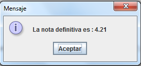

#Universidad Distrital Francisco José de Caldas

#### Integrantes: 

- Julio Cesar Reina      20201099045
- Cristian Gonzales      20201099032
- Andres Lozano          20201099038

#### Docente:

Alejandro Paolo Daza

#### Asignatura: 

Informatica I

### 1. PROLOG

Es un lenguaje declarativo para programación lógica de propósito general , se basa en la representación de relaciones mediantes reglas y hechos . La principal diferencia con el imperativo es que buscamos describir el problema. Prolog es un diminutivo de PROgrammation en LOGique

La sintaxis del lenguaje consiste en lo siguiente:
- Declarar hechos sobre objetos y sus relaciones
- Hacer preguntas sobre objetos y sus relaciones
- Definir reglas sobre objetos y sus relaciones

### 1.1 Hechos

Los hechos no tienen que reflejar el mundo real necesariamente, pero será única y exclusivamente lo que PROLOG tomará como verdadero. Un conjunto de hechos (también llamados cláusulas), junto con un conjunto de reglas, forman lo que se llama una base de datos PROLOG.

ejemplos:

- le_gusta_a(juan,maria).
- valioso(oro).
- tiene(juan,libro).
- da(juan,libro,maria).

### 1.2 Preguntas

PROLOG busca automáticamente en la base de datos si existe un hecho que se puede unificar (es decir, tiene el mismo nombre de predicado, el mismo número de argumentos y cada uno de los argumentos tiene el mismo nombre, uno a uno) con el hecho que aparece en la pregunta. 

- ?- le_gusta_a(juan,maria).

### 1.3 Las Reglas

Existe en PROLOG la posibilidad de definir la relación “abuelo(X,Y)” o la relación “tio(X,Y)” como reglas, además de poderlo hacer como hechos o como conjunción de objetivos.

- abuelo(X,Y):- progenitor(X,Z), progenitor(Z,Y).
- tio(X,Y):- progenitor(Z,Y), progenitor(V,Z), progenitor(V,X).

#### 1.4 Ventajas de PROLOG

- El codigo tiende a ser mucho mas corto, luego es facil de modificar.
- Facilidad de Programar.
- Con PROLOG se pueden estructurar sistemas expertos que emulan la habilidad de un humano para la toma de decisiones.

#### 1.5 Desventajas de PROLOG

- Curva de Aprendizaje larga.
- Se deben establecer muy bien los hechos o la representación del conocimiento, por que pueden haber soluciones erroneas.
- Forma de pensar es diferente como los programadores estan acostumbrados.

### 2. OTROS LENGUAJES USADOS EN PROGRAMACION LOGICA

#### Mercury

Mercury es un lenguaje de alto nivel derivado de Prolog, sin embargo posr sus caracteristicas de implementación suele ser más útil para representar y tratar problemas del mundo real. Combina la expresividad del lenguaje declarativo con técnicas de análisis estático y detección de errores. Ser un lenguaje compilado le permite detectar numerosos errores antes de poder ejecutar la aplicación. El compilador “traduce” el programa de lenguaje Mercury a C. Addicionalmente utiliza módulos, permitiendo gran modularidad en el desarrollo de aplicaciones, solventando así uno de los mayores problemas a los que se enfrentaban los lenguajes de programación lógicos.

#### CLP (FD)

Es una extención de Prolog, especializado en los problemas CSPs (Constraint Satisfaction Problem).Normalmente su implementacion conta de de tres partes: “generación de variables” (donde también se especifica su domino), “definición de restricciones” (sobre las variables) y “labeling”, donde se instancian las variables por enumeración.

#### miniKanren

Es un lenguaje de dominio incorporado para la programación lógica.Su lenguaje central es muy simple teniendo solo tres operadores lógicos y un operador de interfaz. Se ha implementado en un número creciente de lenguajes de host, incluidos Scheme, Racket, Clojure, Haskell, Python, JavaScript, Scala, Ruby, OCaml y PHP, etc. Está diseñado para ser modificado y ampliado fácilmente; las extensiones incluyen la Programación Lógica de Restricciones, programación de lógica probabilística, programación lógica nominal y presentación.

#### SequenceL

Es un lenguaje de programación funcional de propósito general que permite la paralelización automática, teniendo como objetivo principal  mejorar el rendimiento de los procesadores con varios núcleos. Aunque tiene muchas herramientas de paralelización, está enfocado en la facilidad de programación para el usuario. Su principal ventaja es que permite escribir código común, y el software se encarga de maximizar el rendimiento del procesador, por medio de programación paralela. Se caracteriza porque basa su lógica en hechos, reglas y consultas.

#### Datalog

pyDatalog agrega el paradigma de programación lógica a la extensa caja de herramientas de Python. Datalog es un lenguaje declarativo derivado de Prolog. Uno de sus puntos fuertes es la gestión de la complejidad. Los programas de registro de datos son más cortos que su equivalente de Python, y las declaraciones de registro de datos se pueden especificar en cualquier orden, tan simple como una fórmula en una hoja de cálculo.

### 2. EJERCICIO DE APLICACION (NOTAS)

Para esta actividad se eligio realizar la actividad correspondiente a las notas de un curso, donde se establecio un archivo PROLOG con los datos de los estudiantes y sus calificaciones, correspondientes a 3 talleres, 2 parciales y 1 calificacion por asistencia. 

Las Calificaciones se asignarion de la Siguiente manera.

- 50% Parciales
- 30% Talleres
- 20% Asistencia

#### Integracion de Prolog con Java....

Al realizar la consulta por codigo de estudiante el Sistema retorna la nota definitiva de la asignatura, calculada previamente en la logica de PROLOG.

Al seleccionar el Alumno el sistema mostrará la nota definitiva, como se oberva en la siguiente figura.

### 3. Referencias Web

- https://swish.swi-prolog.org/p/Tutorial%20de%20prolog.swinb
- https://github.com/apdaza/universidad-ejercicios/tree/master/prolog
- http://ferestrepoca.github.io/paradigmas-de-programacion/proglogica/tutoriales/prolog-gh-pages/Prolog.pdf
